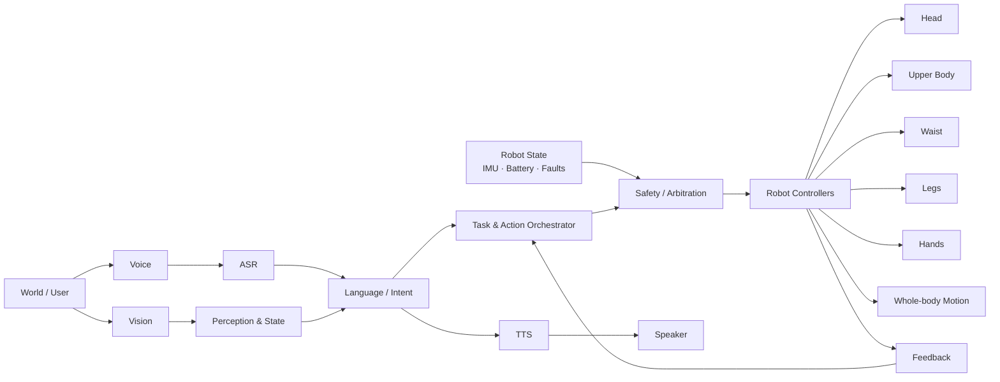
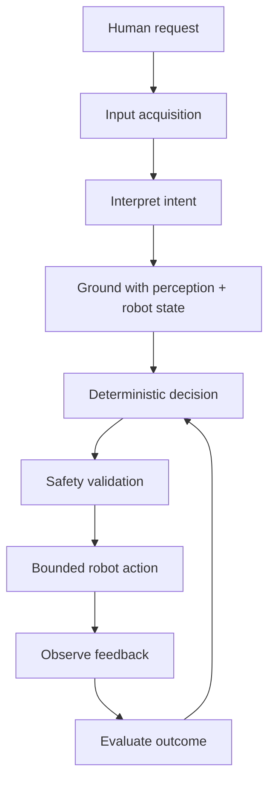

# Walker TienKung — Embodied AI & Humanoid Robotics Engineering

<p align="center">
  
</p>

<p align="center">
  <strong>Reverse engineering · Perception · Voice · ROS 2 · Embodied intelligence · Safe robot control</strong>
</p>

<p align="center">
  
  
  
  
</p>

> **Engineering objective:** evolve Walker from a collection of working subsystems into a reproducible, observable, safety-conscious embodied AI system capable of perception, conversation, grounded decision-making and eventually bounded physical action.

## Executive Overview

This repository is the engineering record for the Walker TienKung humanoid robotics workstream. It documents verified system architecture, ROS 2 interfaces, Host 2 / ORIN_LLM reverse-engineering findings, perception and voice integration, actuator surfaces, runtime evidence, and the roadmap toward autonomous operation.

The work follows a deliberate engineering loop:

**Reverse-engineer → Map → Understand → Isolate → Validate → Integrate → Automate**

The repository distinguishes **verified facts**, **runtime observations**, **working baselines**, and **unverified assumptions**. That distinction is intentional: autonomous robotics should be built from evidence and bounded interfaces rather than inferred behavior.

## Current System State

| Capability | Status | Engineering evidence |
|---|---|---|
| Robot host architecture | ✅ Mapped | Host 2 / ORIN_LLM baseline captured |
| ROS 2 graph | ✅ Mapped | Nodes, topics, services and packages inventoried |
| RGB-D perception | ✅ Working baseline | Orbbec + ROS 2 + Foxglove workstream |
| Voice input | ✅ Working baseline | `tkvoice` audio pipeline |
| Speech recognition | ✅ Integrated | FunASR WebSocket path identified |
| Local conversation | ✅ Working baseline | Qwen through Ollama-compatible API |
| Speech output | ✅ Integrated | Piper + AudioPlayer path identified |
| Whole-body control surfaces | ✅ Identified | Head, arms, legs, waist, hands, body velocity |
| Safe action layer | 🔄 Next | Requires limits, mapping, arbitration and validation |
| Autonomous task execution | ⏳ Planned | Perception → reasoning → action → feedback |
| Deterministic startup | ⏳ Planned | Readiness supervisor / orchestration |

## Architecture at a Glance



### Embodied interaction loop



## Perception

The perception workstream is centered on the robot's Orbbec RGB-D camera and ROS 2 data path. Camera topics observed on the perception host include RGB image, depth image, camera information, point cloud, filtering status and TF data.

Foxglove has been validated as the visualization layer for camera data during development.

The intended evolution is:

```text
Camera
  ↓
RGB-D data
  ↓
Perception
  ↓
Objects / people / scene state
  ↓
Task reasoning
```

## Voice & Conversation

The current working voice baseline is **tkvoice + FunASR + Qwen/Ollama + Piper**.

```mermaid
flowchart LR
    MIC[Robot audio subsystem] -->|TCP 10.42.0.127:9080| PUB[tk_audio_publisher]
    PUB --> AF[AudioFrame]
    AF --> TXT[tk_asr_text_publisher]
    TXT -->|WebSocket 192.168.41.1:10097| ASR[FunASR]
    ASR --> ROS[/asr_sentence/]
    ROS --> PROC[tk_audio_process]
    PROC --> LLM[Ollama-compatible API :11434]
    LLM --> Q[Qwen]
    Q --> P[Piper]
    P --> PLAY[AudioPlayer]
    PLAY --> SPK[Speaker]
```



The `audio_service` package exposes the ROS executables `tk_audio_publisher`, `tk_asr_text_publisher` and `tk_audio_process`. The source-level findings are documented under [`robot/host-02-orin-llm/architecture/voice-stack.md`](robot/host-02-orin-llm/architecture/voice-stack.md).

**Important runtime qualification:** the LLM client probes `192.168.41.3` before `192.168.41.2`, so the active Ollama host is discovered rather than safely assumed from the Host 2 role alone.

## Host 02 — ORIN_LLM

Host 2 has been identified as the AI + audio workstream on an NVIDIA Jetson AGX Orin Developer Kit running Ubuntu 22.04.4 LTS, ARM64/aarch64, Linux `5.15.148-tegra`, with ROS 2 Humble.

See:

- [`robot/host-02-orin-llm/README.md`](robot/host-02-orin-llm/README.md)
- [`robot/host-02-orin-llm/inventory/host.md`](robot/host-02-orin-llm/inventory/host.md)
- [`robot/host-02-orin-llm/snapshot/README.md`](robot/host-02-orin-llm/snapshot/README.md)

## ROS & Body-Control Surface

The current evidence establishes interfaces across the major body subsystems:

| Subsystem | Position command | Velocity command | State |
|---|---|---|---|
| Head | `/head/cmd_pos` | `/head/cmd_vel` | `/head/status` |
| Arms | `/arm/cmd_pos` | `/arm/cmd_vel` | `/arm/status` |
| Legs | `/leg/cmd_pos` | `/leg/cmd_vel` | `/leg/status` |
| Waist | `/waist/cmd_pos` | `/waist/cmd_vel` | `/waist/status` |
| Left hand | `/inspire_hand/ctrl/left_hand` | — | `/inspire_hand/state/left_hand` |
| Right hand | `/inspire_hand/ctrl/right_hand` | — | `/inspire_hand/state/right_hand` |
| Whole body | — | `/hric/robot/cmd_vel` | `/hric/motion/status` |

The custom motor position/speed messages expose motor identifiers and command parameters, while motor status exposes position, speed, current, temperature and error information.

The latest read-only actuator baseline captured:

- Head IDs `1–3`
- Arm IDs `11–17` and `21–27`
- Leg IDs `51–56` and `61–66`
- Waist ID `31`
- Six joint channels per hand
- Observed motor error fields were `0` in the captured baseline
- IMU error reported `0`
- Battery telemetry was available

> **Safety note:** an observed healthy state is not equivalent to an established safe command range. Position limits, sign conventions, units, reference frames, watchdogs, arbitration and fault recovery must be verified before physical actuation is automated.

## Control Philosophy

Free-form LLM output will **not** be connected directly to motor command topics.

The intended architecture is:

```text
Natural language
      ↓
Structured intent
      ↓
Deterministic action specification
      ↓
Safety / limit validation
      ↓
Controller interface
      ↓
Actuation
      ↓
State feedback
      ↓
Outcome verification
```

This gives the language model a reasoning role without making it the final authority over low-level actuator safety.

## Milestone Roadmap

### M1 — Observe & Map ✅

- Host roles identified
- ROS 2 graph inventoried
- Custom interfaces identified
- Network relationships investigated
- Runtime evidence captured

### M2 — Perception ✅

- Orbbec RGB-D topics observed
- Foxglove visualization established
- Perception host mapped

### M3 — Voice & Conversation ✅

- tkvoice source structure inspected
- Audio transport identified
- FunASR path identified
- Qwen/Ollama conversation verified
- Piper speech output path identified

### M4 — Grounded Embodiment 🔄

- Map actuator identifiers and semantics
- Establish verified command limits and units
- Implement deterministic action abstraction
- Validate bounded individual actions
- Extend across head, arms, hands, waist and legs

### M5 — Multimodal Task Execution ⏭️

- Ground language in camera and robot state
- Resolve simple spatial references
- Execute bounded multi-step tasks
- Verify outcomes using feedback

### M6 — Autonomous Runtime ⏭️

- Deterministic startup orchestration
- Service/node readiness checks
- Health monitoring
- Recovery and fault handling
- Operator-visible system status

## Evidence & Reproducibility

Point-in-time evidence is maintained under [`robot/host-02-orin-llm/snapshot/`](robot/host-02-orin-llm/snapshot/).

The engineering process uses read-only discovery before physical control. Snapshot captures include host information, routes, relevant processes, ROS nodes/topics/services/packages, custom interfaces, actuator interfaces, live state and software inventory.

## Repository Layout

```text
.
├── README.md                         # Project-level engineering overview
└── robot/
    └── host-02-orin-llm/
        ├── README.md                 # Host 02 engineering notes
        ├── architecture/
        │   └── voice-stack.md        # Verified voice architecture
        ├── inventory/
        │   └── host.md               # Platform inventory
        ├── ros/
        │   └── tkvoice-ros-interfaces.md
        └── snapshot/
            ├── README.md             # Snapshot interpretation
            ├── inventory/            # Host/runtime evidence
            └── ros/                  # ROS graph/interface evidence
```

## Publication Boundary

This is an engineering repository, not a vendor software mirror. Sensitive material is deliberately excluded, including credentials, private keys, machine/boot identifiers, model weights, large model caches, sensitive runtime logs, and unreviewed proprietary configuration.

## Upstream Platform Reference

Walker TienKung is a research and education humanoid platform from UBTECH. The official product page describes open interfaces for joints and sensors, secondary-development resources, RGB-D data, proprioceptive state and natural-language task data. citeturn805449search0

The hero image above is from the official UBTECH Walker Tienkung product site. citeturn137859view0

## Engineering Principle

> **Build autonomy from verified interfaces, bounded actions and feedback — not assumptions.**
